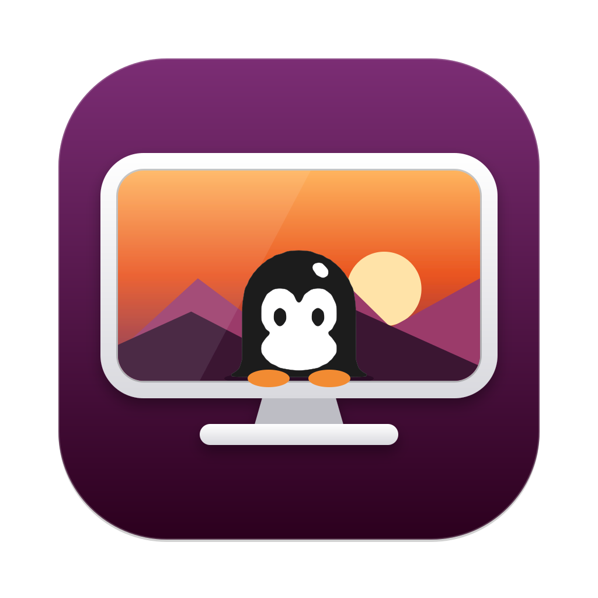

<p align="center">
  
</p>

<h1 align="center">try-ubuntu</h1>

<p align="center">A live ISO of a minimal Ubuntu for arm64, to try the amazing penguin ;)</p>

- Ubuntu 26.04 LTS (resolute) with a minimal **GNOME 50**, 26.04's own
  (the branch `gnome-51` has GNOME 51 instead, backported from 26.10)
- boots with Limine (EFI) and Plymouth
- runs on a btrfs root with subvolumes, managed by snapper; with a
  persistent disk, you can boot any snapshot from the Limine menu
- boots from the command line with QEMU; the live session starts in your
  shell's language

## Try it

On macOS or Linux, one command downloads the ISO from the
[latest release](https://github.com/antoniopicone/try-ubuntu/releases/latest),
gets QEMU and boots the live session:

```bash
curl -fsSL https://raw.githubusercontent.com/antoniopicone/try-ubuntu/main/install.sh | sh
```

Options after `sh -s --` go to [run-qemu.sh](run-qemu.sh), except
`--rebuild`, `--arch`, `--on-usb` and `--system-qemu`:

```bash
curl -fsSL https://raw.githubusercontent.com/antoniopicone/try-ubuntu/main/install.sh | sh -s -- --lang de_DE --no-persist
curl -fsSL https://raw.githubusercontent.com/antoniopicone/try-ubuntu/main/install.sh | sh -s -- --rebuild
curl -fsSL https://raw.githubusercontent.com/antoniopicone/try-ubuntu/main/install.sh | sh -s -- --arch x86
curl -fsSL https://raw.githubusercontent.com/antoniopicone/try-ubuntu/main/install.sh | sh -s -- --arch x86 --on-usb
```

- **Which ISO**: this computer's architecture's, or `--arch arm` / `--arch x86`. The releases
  have `ubuntu-live-arm64.iso` and `ubuntu-live-amd64.iso`. An ISO runs
  with hardware acceleration on a host of its own architecture (hvf on
  Apple Silicon or an Intel Mac, kvm on an x86 or arm64 Linux), and
  emulated (TCG, slow) on the other.
- **QEMU**: the release's own build, with GPU acceleration; nothing gets
  installed system-wide. On Apple Silicon it runs arm64 ISOs, with nested
  virtualization (see [QEMU for Apple Silicon](#qemu-for-apple-silicon));
  on Linux, x86 or arm64, it runs ISOs of both architectures (see
  [QEMU for Linux](#qemu-for-linux)). Elsewhere it's the system's: Homebrew's
  on an Intel Mac and for x86 ISOs on Apple Silicon (`brew install qemu`).
  On a Linux where the release's build doesn't start (a glibc older than
  2.35, no GTK 3), QEMU is installed with apt (Debian, Ubuntu), dnf (Fedora)
  or pacman (Arch), together with the UEFI firmware (AAVMF or OVMF; this
  uses sudo). `--system-qemu` always does that, and never uses the
  release's build: on Fedora and Arch it installs the packages QEMU is
  split into there (the GTK window, OpenGL, the virtio GPU with and without
  OpenGL, PipeWire, PulseAudio and ALSA), so the desktop renders on the GPU
  with the distribution's QEMU too.
- **Files**: the ISO, the persistent disk and `run-qemu.sh` go in
  `~/.local/share/try-ubuntu` (set `TRY_UBUNTU_DIR` to change it). The ISO
  is checked against the release's `SHA256SUMS`, and an interrupted
  download resumes.
- **What it shows**: on a terminal, the logo and the steps as a list, with
  a spinner on the one running and a tick on those done. What the commands
  print goes to `~/.local/share/try-ubuntu/install.log`, and its last line
  next to the spinner (`tail -f` it to follow a long build). Piped or
  redirected, it prints plain lines instead.
- **Updates**: running it again boots the same ISO, or downloads the newer
  one when there's a new release. The old persistent disk only works with
  its own ISO, so it's moved aside to `persist-<tag>.qcow2` (see
  [How the live btrfs works](#how-the-live-btrfs-works)).
- **Starting over**: `--rebuild` deletes what the script downloaded and the
  caches (the ISO, partial downloads, the release's QEMU, `run-qemu.sh`,
  and the kernel `run-qemu.sh` extracts from the ISO for nested
  virtualization), then downloads them again from the latest release. The
  persistent disks and the UEFI variables (`efivars.fd`) stay. A persistent
  disk is still moved aside when the latest release isn't the one it was
  made with. Homebrew's or the distribution's QEMU isn't touched.
- **A USB stick for a real computer** (`--on-usb`): see
  [On a real computer](#on-a-real-computer).

## Build it

```bash
./build.sh --xkb it          # → dist/ubuntu-live-<arch>.iso (~1.4 GB), for this computer's architecture
./build.sh --arch x86        # → dist/ubuntu-live-amd64.iso (emulated on an arm64 host: slow)
./build.sh --hardware        # → dist/ubuntu-live-<arch>-hardware.iso, for real computers
./qemu/build.sh              # → dist/qemu-macos-arm64 or dist/qemu-linux-<arch> (optional: GPU, nested virtualization on a Mac)
./run-qemu.sh                # boot it in a window (--serial: serial console in the terminal too)
./run-qemu.sh --lang de_DE   # boot in German instead of the host's language
./run-qemu.sh --no-persist   # RAM only (by default changes and snapshots go to a persistent disk)
./mount-home.sh              # macOS, VM off: your home on the persistent disk, in the Finder
```

`run-qemu.sh` attaches a persistent disk by default (see
[How the live btrfs works](#how-the-live-btrfs-works)), so what you set up
survives reboots. After `./build.sh` makes a new ISO, the next
`./run-qemu.sh` moves the old disk aside and starts a new one.

On Linux, `build.sh` needs root (`sudo ./build.sh`, with the same
options): rootless podman can't make the rootfs's device nodes or
loop-mount the ISO's btrfs image (with docker it's for installing
qemu-user and handing the ISO back). The ISO and `dist/` are handed back to
you at the end. The ISO is of this computer's architecture unless `--arch`
says otherwise: the other one (`--arch x86` on arm64, `--arch arm` on x86)
builds emulated, with qemu-user registered in
binfmt_misc (`qemu-user-binfmt` or `qemu-user-static`; `build.sh`
installs it when it's missing). `qemu/build.sh` needs neither root nor emulation.

From a checkout, `run-qemu.sh` looks for QEMU in `dist/qemu-macos-arm64`
(`dist/qemu-linux-<arch>` on Linux), which only `./qemu/build.sh` creates
there (install.sh downloads it to `~/.local/share/try-ubuntu/dist`, not to
the checkout). Without it, it uses the QEMU on `PATH` (e.g. Homebrew's):
on a Mac GNOME then renders in software, on Linux only when that QEMU has
no `virtio-gpu-gl` or no GTK window.

On first boot the live user (`ubuntu`) logs in by itself and the welcome
app takes over: it creates your user and logs out to GDM (see
[The desktop](#the-desktop)).

## On a real computer

```bash
./install.sh --arch x86 --on-usb      # from a checkout, or through curl | sh -s -- --arch x86 --on-usb
```

`install.sh --on-usb` makes a live USB stick for a real computer:

1. **It builds the ISO locally.** The releases' ISOs are made for QEMU:
   the "virtual" kernel cut down to what a VM needs, and no firmware.
   `build.sh --hardware` makes `ubuntu-live-<arch>-hardware.iso` instead,
   with the generic kernel, all of `linux-firmware` (every vendor's: Wi-Fi,
   GPUs, Bluetooth), Intel's sound DSP firmware, ALSA's device profiles,
   wpa_supplicant, the Vulkan drivers and, on x86, the CPU microcode. That
   ISO is over GitHub's 2 GiB limit for a release asset, hence the local
   build. It uses the release's sources (or the checkout install.sh is run
   from) and podman, or docker when that's what is installed (it must be
   running). With neither, install.sh installs podman: on a Mac with
   Homebrew, creating a rootful machine if there's none; on Linux with
   apt, dnf or pacman. On Linux the build runs with sudo. For the other
   architecture (x86 on Apple Silicon or an arm64 Linux, arm64 on an x86
   Linux) everything runs emulated (qemu-user: in the podman machine or
   Docker Desktop's VM, or
   installed and registered with binfmt_misc on Linux), so it takes many
   hours. Later builds reuse the cache. In an emulated build, the ISO
   step runs in a native container on the same cache, since qemu-user
   can't pass btrfs's ioctls (snapshot, resize) on. The checks that run
   downloaded binaries (uv, rclone, Ghostty's config) only warn there,
   since some can't run under the emulator. Their sha256 is checked
   anyway, and native builds run them. Other arguments go to build.sh
   (e.g. `--xkb it`).
2. **It writes the ISO to a USB stick.** It lists the USB disks (`diskutil`
   on macOS, `lsblk` on Linux) and asks which one to use. You confirm by
   typing the disk's name, and it writes the ISO with `dd`. The ISO is a
   hybrid image, so the stick boots like a CD.

The computer has to boot it through UEFI with **Secure Boot off**, because
Limine isn't signed. In the live session, the welcome app can install
Ubuntu on the computer.

### Installing on a disk

Right after the keyboard, the welcome app lists the disks the system can go
on ([install-system](overlay/usr/local/lib/live-install/install-system)
`list`). Each needs at least 20 GB:

- **the whole disk**, erased: GPT, a 512 MiB EFI system partition and a
  btrfs partition;
- **its free space**, next to what's already there (Windows, say): on a
  GPT disk, the two partitions go in its largest unpartitioned stretch,
  and the other partitions stay as they are.

"Keep trying it" is the default. A disk the live system itself stands on
(the USB stick, the persistent disk) or with a mounted partition is never
offered. Choosing a disk asks for confirmation, then `install-system
install` does the work. It runs through `pkexec`, under a polkit rule that
lets the live session run it without a password. It refuses on an
installed system or once the welcome app is done, so the rule can't be
used to erase disks later.

**How the system gets to the disk.** The running root filesystem is the
ISO's read-only seed plus a writable sprout, in RAM or on the persistent
disk (see [How the live btrfs works](#how-the-live-btrfs-works)).
install-system adds the new btrfs partition to it with `btrfs device add`,
then removes the sprout and the seed with `btrfs device remove`: btrfs
moves everything they held onto the partition while the system keeps
running. Nothing is copied by hand. The subvolumes, the snapper
snapshots, and what the session already changed (language, keyboard,
theme) all come along, and the live medium is no longer needed: its
loops are detached and it's unmounted. Then:

- `/etc/fstab` mounts `@`, `@home`, `@var` and `@snapshots` from the
  partition, and the EFI system partition on `/boot/efi`. The btrfs
  filesystem (and its GPT partition) is named `Ubuntu-root`.
- The kernel the ISO booted goes back in `/boot` (the ISO keeps it as
  `live/vmlinuz`), with an initramfs for booting from disk
  (`update-initramfs`).
- [live-limine-update](overlay/usr/local/sbin/live-limine-update) puts
  Limine on the EFI system partition, along with copies of the two newest
  kernels and their initramfs (on arm64, the raw `Image` that
  `unzboot.py` extracts), and writes its menu: `root=UUID=… rootflags=subvol=@`.
  The kernel's and initramfs-tools' hooks (`/etc/kernel/postinst.d`,
  `postrm.d`, `/etc/initramfs/post-update.d`) run it again on every kernel
  update. On the live system it does nothing.
- `efibootmgr` adds a boot entry, "Ubuntu (try-ubuntu)", first in the boot
  order. Limine is also at the fallback path `\EFI\BOOT\`, for firmware
  that loses boot entries.

The welcome app then goes on as usual: account, picture, appearance. Its
last page doesn't log out: it asks to remove the USB stick and offers
**Restart**. The `ubuntu` user is deleted at that first boot from the disk
(live-retire-user.service, before GDM).

## What's in it

| | |
|---|---|
| Base | `debootstrap --variant=minbase` resolute with a hand-picked package set (no `ubuntu-minimal` or console-setup): openssh, sudo |
| Kernel | `linux-image-virtual` (7.0), pruned to the modules a VM needs, with no firmware. initramfs-tools with zstd -19 |
| Boot | **Limine** 11 (arm64 UEFI), with a menu to boot snapper snapshots, and Plymouth with the `spinner` theme (GNOME's). The ISO is hybrid (El Torito EFI + appended GPT ESP), so it also boots when written with `dd` to a USB stick |
| Filesystem | btrfs with the subvolumes `@` → `/`, `@home` → `/home`, `@var` → `/var`, `@snapshots` → `/.snapshots` (flat layout, `compress=zstd:1`). **snapper** manages `/` (snapshot #1 is the image as built) and `/home` (every hour: *Previous Versions* in Files) |
| Desktop | a minimal **GNOME 50**: Shell, Settings, the vanilla GNOME session, GDM (see [The desktop](#the-desktop)) |
| Theme | dark style with GNOME's blue accent, Adwaita Sans, Yaru icons, and **one of Ubuntu's stock wallpapers, picked at random at each build** |
| Apps | **ghostty** (JetBrains Mono Nerd Font, Catppuccin Mocha; OpenGL in software on the live system under QEMU's virgl, which lacks the OpenGL 4.3 it needs; once installed on a disk it uses the GPU), with **Ptyxis** when it can't start, **Nautilus** (with *Open in Ghostty* and *Previous Versions*), **Brave Origin** (in the desktop's language and light/dark style), GNOME Software (with **Flatpak** and Flathub), Calculator, Papers (PDF), Fonts, Text Editor, Disks, Resources, Extensions, **Cloud Config** (Google Drive, OneDrive, Dropbox, Nextcloud and iCloud Drive in Files), **Cloud Backup** (hourly, end-to-end encrypted backups of your home folder with restic, and restore, to one of those clouds, Samba or SFTP), **Wallpapers** (a wallpaper from several photo services at once, with filters, a preview on the desktop and an automatic change) |
| Fonts | Adwaita Sans; Liberation, **Carlito** and **Caladea** (metric-compatible with Arial/Times New Roman/Courier New and Calibri/Cambria, so Office documents keep their layout); JetBrains Mono; **JetBrains Mono Nerd Font** (GNOME's monospace font and Ghostty's) and **Hack Nerd Font Mono** |
| Network | NetworkManager (via netplan, as on Ubuntu Desktop) |
| QEMU integration | sound (virtio-sound, PipeWire), the clipboard shared with the QEMU window (**spice-vdagent**), the host's shared folder (9p + **bindfs**, see [Running](#running)) |
| Services | polkit, UPower, power-profiles-daemon, BlueZ, GeoClue, avahi-daemon (+ nss-mdns), Tailscale, ufw |
| Tools | podman (rootless: uidmap + passt), git, curl, wget, **eza** (`ls` is `eza --icons=always`), **apfs-fuse** (Mac disks, read-only, also from Nautilus) |
| AI | the **AI** app (see [The desktop](#the-desktop)): Claude's and ChatGPT's desktop apps, Claude Code, Codex and OpenCode, a local model with Ollama and a knowledge base of your files (qmd), each installed when you pick it; skills that teach the agents this system; crashes kept by **systemd-coredump** (with gdb) and handed to your agent from a notification |
| Development | Python 3.14 with `pip` and `venv`, **uv** / uvx (0.12, from Astral's releases), **zsh** (the default shell) with the **pure** prompt |
| Languages | English, plus Italian, Spanish, French, German and Portuguese (Brazil): locales and Ubuntu's `language-pack-*-base` / `language-pack-gnome-*-base` |
| Excluded | ModemManager, pinned to priority -1 so no dependency can pull it in |

### Package sources

Each extra repository has its signing key vendored in
[overlay/etc/apt/keyrings/](overlay/etc/apt/keyrings/). The build checks
each keyring's fingerprints and fails if they don't match exactly.

| Repository | What it provides | Key |
|---|---|---|
| Ubuntu `resolute` (main, restricted, universe) | base system | `ubuntu-keyring` |
| Flathub (a Flatpak remote, [scripts/flathub.flatpakrepo](scripts/flathub.flatpakrepo)) | Flatpak apps, in GNOME Software | `6E5C05D9…4184DD4D907A7CAE` |
| Ubuntu `resolute` sources | the GNOME packages with local fixes, rebuilt (see [The desktop](#the-desktop)) | `ubuntu-keyring` |
| `brave-browser-apt-release.s3.brave.com` | Brave Origin (`brave-origin`, and `brave-keyring`, which then keeps the keyring up to date). Pinned so it provides **only** those | `DBF1A116…0686B78420038257`, `47D32A74…68D513D36A73CD96`, `B2A3DCA3…DE4EC67BE4B0DCA0` |
| `pkgs.tailscale.com` | tailscale | `2596A99E…458CA832957F5868` |

These files are pinned and checked with sha256, not taken from a
repository:
- [uv](https://github.com/astral-sh/uv) (`UV_*` in build-rootfs.sh)
- [pure](https://github.com/sindresorhus/pure) (`PURE_*`)
- [Limine](https://codeberg.org/Limine/Limine) (`LIMINE_*` in
  build-iso.sh)
- the GNOME Shell extensions (`EXTENSIONS` in desktop-gnome.sh)
- [Hack and JetBrains Mono Nerd Fonts](https://github.com/ryanoasis/nerd-fonts),
  the Mono variants only, JetBrains Mono in its four terminal styles
  (`HACK_NERD_*`, `JETBRAINS_NERD_*` in build-rootfs.sh)
- [apfs-fuse](https://github.com/sgan81/apfs-fuse) and its lzfse
  submodule, built from source by
  [scripts/build-apfs-fuse.sh](scripts/build-apfs-fuse.sh) (it has no
  releases: a pinned commit)

### Footprint

The ISO would be much larger without these measures:

- The package set is chosen by hand (see Base above), with no
  recommends.
- dpkg path-excludes skip docs, man pages, info pages, Qt translations and
  every translation except those of the image's languages
  ([overlay/etc/dpkg/dpkg.cfg.d](overlay/etc/dpkg/dpkg.cfg.d/01-live-excludes)).
  Ubuntu's language packs only cover what Ubuntu builds in main: universe
  apps (GNOME Software...) ship their own.
- Kernel modules are cut down to filesystems, networking, crypto, virtio,
  USB/HID/SCSI/NVMe, the virtio-gpu DRM driver and virtio-sound. Other
  sound cards, other GPUs, wireless/ethernet NICs and media drivers are
  gone, and so is all firmware. The build fails if a required module was removed.
- glibc's extra charset converters (`libc-gconv-modules-extra`) are
  removed.
- Brave keeps only the translations for the image's languages (all of
  them take ~100 MB).
- `/boot` isn't in the rootfs: the kernel and initramfs sit only on the ISO.
- Snapshot #1 shares every extent with `@`, so it costs only metadata.
- The btrfs seed uses zstd:15.

What's left is mostly needed at runtime: LLVM for Mesa's llvmpipe
(software rendering), GNOME, Brave, GTK 4. Limine also needs the kernel
as a raw `Image` (~70 MB instead of the ~24 MB zboot vmlinuz, see below).

## How the live btrfs works

`live/rootfs.btrfs` on the ISO is a compressed btrfs image flagged as a
**seed device**. At boot, the initramfs script
([overlay/etc/initramfs-tools/scripts/btrfslive](overlay/etc/initramfs-tools/scripts/btrfslive),
chosen with `boot=btrfslive`) takes these steps:

1. It finds the medium by label (`UBUNTU_LIVE`, written to the initramfs's
   `conf.d/btrfslive` at build time) and loop-mounts the seed image
   read-only.
2. It adds a second "sprout" device. btrfs turns the seed into a writable
   copy-on-write filesystem, and everything written goes to the sprout:
   - **RAM** (default): a sparse file on tmpfs, lost at shutdown.
   - **persistent disk**: the QEMU disk with serial `ubuntu-persist`
     (`run-qemu.sh --persist`), or `btrfslive.persist=DEV`. A blank disk is
     claimed on first boot and reopened on later boots. A disk that holds
     anything else is never touched. The disk extends the seed of *that*
     ISO build, so after a rebuild btrfslive would reject it and run in RAM:
     `run-qemu.sh` records the ISO's checksum next to the disk
     (`persist.qcow2.iso`) and, when the ISO changes, moves the old disk
     aside to `persist-<date>.qcow2` and creates a new one.
3. It mounts `@` (or a snapshot, see below), `@home`, `@var` and
   `@snapshots` just as an installed system would.

This means the live session runs on real btrfs, so snapshots,
`btrfs subvolume`, compression and the rest all work.

### Browsing the persistent disk from macOS

[mount-home.sh](mount-home.sh) opens your home folder, as kept on the
persistent disk, in the Finder, with the VM switched off. The disk can't be
mounted on its own: it's a sprout, so it needs the seed of the ISO that
made it, and macOS can't read btrfs anyway. Like `build.sh`, the script
works in a privileged container on the podman machine (or in docker's VM,
picked as `build.sh` does):

1. It builds a small image (`try-ubuntu-mount`: btrfs-progs, qemu-utils,
   Samba) and loads `nbd`, `isofs` and `btrfs` in the machine (over
   `podman machine ssh`, or with docker from a container in the VM's own
   namespaces).
2. It loop-mounts the ISO and its `live/rootfs.btrfs` (the seed), attaches
   the qcow2 with `qemu-nbd --read-only`, and mounts the `@home` subvolume
   read-only. If the session didn't shut down cleanly, it skips the btrfs
   log (`rescue=nologreplay`), so the last few seconds before the crash
   don't show.
3. It shares the home folder over SMB on `127.0.0.1` only, with a random
   password for that run, then mounts it in `dist/home` with `mount_smbfs`
   and opens it in the Finder.
4. Ctrl-C unmounts it all: the Mac's mount, Samba, btrfs, the nbd and loop
   devices, and the container.

It refuses to start while a VM is using the disk (the disk would change
under the mount), or when `persist.qcow2.iso` says the disk belongs to
another ISO. Everything is read-only, so it can't damage the disk. Whose
home: by default, the user the welcome app created (the only folder in
`/home` other than `ubuntu`), or `ubuntu` if there's none yet.

| Option | |
|---|---|
| `--user NAME` | that user's home |
| `--all` | the whole `/home` |
| `--iso PATH`, `--persist FILE` | another ISO and disk (default: `dist/ubuntu-live-arm64.iso`, `dist/persist.qcow2`), e.g. a disk moved aside to `persist-<date>.qcow2` with the ISO it belongs to |
| `--at DIR` | where to mount it on the Mac (default: `dist/home`) |
| `--port PORT` | local port of the SMB server (default: 44545) |

It runs from a checkout, since install.sh doesn't download it. For the
files install.sh keeps, pass
`--iso ~/.local/share/try-ubuntu/dist/ubuntu-live-arm64.iso --persist ~/.local/share/try-ubuntu/dist/persist.qcow2`.

| Kernel parameter | |
|---|---|
| `btrfslive.ram=<MiB>` | size of the RAM sprout (default: 75% of RAM) |
| `btrfslive.persist=<DEV>` / `=no` | persistent sprout device / force RAM |
| `btrfslive.snapshot=<N>` / `=ask` | boot snapper snapshot N / list the snapshots and ask |
| `btrfslive.label=<LABEL>` | label of the live medium |

## Snapshots and Limine

- **snapper** (`/etc/snapper/configs/root`) snapshots `/`. You get:
  - snapshot #1, made at build time
  - one at every boot (`snapper-boot`)
  - one before every apt/dpkg run ([80-snapper](scripts/build-rootfs.sh))
  - any you make yourself with `sudo snapper create -d "…"`
  
  Snapshots survive reboots only with the persistent disk.
- **snapper** (`/etc/snapper/configs/home`) also snapshots `/home`, every
  hour (`snapper-timeline.timer`). It keeps 24 hourly, 7 daily and 4
  weekly ones, as long as they fit in half the disk. They live in
  `/home/.snapshots`, a subvolume of `@home` that
  [live-home-snapshots.service](overlay/etc/systemd/system/live-home-snapshots.service)
  makes at the first boot. They aren't in the Cloud Backup: run-backup
  stays on `@home` itself. `SYNC_ACL` lets the user (`ALLOW_USERS`: the
  live user, then the one the welcome app creates) list them and go into
  them. Inside, their files keep their own permissions.
- **Tailscale in Files**: on a tailnet, the sidebar has "Tailscale" (the
  VPN icon), a folder per device of the network: `~/Tailscale`, a FUSE
  mount of [live-tailnet](overlay/usr/local/bin/live-tailnet), a user
  service (pyfuse3) that reads `tailscale status` every few seconds. Off
  the tailnet the folder isn't there.
  - **The devices** have their system's icon
    ([iPhone, iPad, Android, Mac, Windows, Linux, or a server](overlay/usr/local/share/live-tailnet/icons/)),
    with a green dot when they're online and greyed out when they aren't.
  - **Taildrop**: drop files on a device, or copy them into its folder,
    and they're sent to it. A file written there is the input of
    `tailscale file cp`, so nothing is kept on this computer and the
    copy's progress is the transfer's; a notification says what was sent,
    or why it wasn't. The devices that can't receive (offline, or someone
    else's) are read-only folders. Folders can't be sent: Taildrop sends
    files.
  - **Receiving**: what your other devices send to this computer goes to
    the Downloads folder as it comes (`tailscale file get --wait`; a
    same-named file gets a number), with a notification that opens it or
    shows it in Files.
  - **Properties and menus**, from a Nautilus extension
    ([live-tailnet.py](overlay/usr/share/nautilus-python/extensions/live-tailnet.py)):
    a device's Properties have a "Tailscale" page (addresses, name on the
    network, system and model, Tailscale's version, owner, last seen, the
    key's expiry, whether it receives files); its menu copies its address
    or name and has "Send Files…"; any file's menu has "Send with
    Taildrop", with the devices that can receive now. Both ask Files
    itself to copy (`org.gnome.Nautilus.FileOperations2`), so the transfer
    is one of its operations, with its progress, like a drop.
- **Previous Versions** in Files: right-click a file or folder in a home
  folder, or a folder's background. A Nautilus extension
  ([live-file-versions.py](overlay/usr/share/nautilus-python/extensions/live-file-versions.py))
  opens [live-file-versions](overlay/usr/local/bin/live-file-versions):
  - **a file**: its distinct versions, newest first. Snapshots in which it
    didn't change count as one. Each version can be opened (read-only),
    saved as a copy next to the file ("name (version of …).ext"), or
    restored. Before restoring, snapper takes a snapshot, so the version
    being replaced shows up among the earlier ones.
  - **a folder**: the snapshots it's in, each opened in Files as the folder
    was then, to copy back what was deleted or changed.
- The **Limine menu** has a *Snapper snapshots* section:
  - *#1 Live image as built*
  - *Choose at boot*: the initramfs lists every snapshot, including the ones
    on the persistent disk, and asks which one to boot
- Booting a snapshot starts a **writable copy** of it (`@boot-snapshot`),
  and `@` itself is left untouched. The copy is dropped at the next normal
  boot. To keep that state, run **`live-rollback`**: it makes the booted
  snapshot the new `@` and keeps the previous one as `@old-<date>`.
- Limine boots the kernel with its Linux protocol, which needs the raw arm64
  `Image`. Ubuntu's vmlinuz is an EFI zboot binary, so
  [scripts/unzboot.py](scripts/unzboot.py) extracts the Image at build time.
- Limine's background is the build's wallpaper (its dark variant). Under
  QEMU with virtio-gpu, though, the firmware only offers a "Blt-only"
  display with no linear framebuffer. Limine then falls back to the
  firmware's text console, so its wallpaper and colors only show on
  hardware with a normal framebuffer. The menu works either way.

## Build

`build.sh` runs everything in a privileged **podman** or **docker**
container (`ubuntu:26.04`, of the ISO's architecture: native arm64 on the
podman machine or Docker Desktop on Apple Silicon, native for its own
architecture on Linux, where it needs root). It uses the one that's
installed, podman when both are; `CONTAINER_ENGINE=docker ./build.sh`
picks. Each engine has its own cache and builder images:

1. [scripts/build-gnome.sh](scripts/build-gnome.sh) rebuilds the GNOME
   packages with local fixes (see [The desktop](#the-desktop)), if any.
   It's cached in the volume `try-ubuntu-gnome50-cache` (GNOME 51's
   builds, on the branch `gnome-51`, keep `try-ubuntu-cache`), then skipped.
2. [scripts/build-apfs-fuse.sh](scripts/build-apfs-fuse.sh) builds
   apfs-fuse, and [scripts/build-icloud-linux.sh](scripts/build-icloud-linux.sh)
   icloud-linux (Rust, with Ubuntu's toolchain), both cached the same way
   (~1 minute each).
3. [scripts/build-rootfs.sh](scripts/build-rootfs.sh) builds the rootfs,
   and sources [scripts/desktop-gnome.sh](scripts/desktop-gnome.sh) for
   GNOME's packages and configuration. It:
   - runs debootstrap
   - adds the extra repositories and installs the packages and the
     [overlay/](overlay/)
   - sets up Plymouth, ufw, rootless podman, snapper, uv, zsh + pure,
     Nerd Fonts, apfs-fuse, icloud-linux, Flathub and the default apps
   - picks the wallpaper
   - configures GNOME, GDM and the welcome app
   - slims the image down and builds the initramfs
4. [scripts/build-iso.sh](scripts/build-iso.sh) builds the ISO:
   - lays out the subvolumes and runs `mkfs.btrfs --rootdir --subvol`
   - loop-mounts the image to add snapper snapshot #1 (this is why
     `build.sh` passes the host's `/dev` to the container)
   - shrinks the image and runs `btrfstune -S 1`
   - writes the Limine menu and runs xorriso

Options: `--xkb LAYOUT` sets the keyboard layout for the session and the
login screen (default `us`), and `--clean` empties the cache. Each run
takes ~6 minutes once GNOME is cached.

## Running

`run-qemu.sh` uses `qemu-system-aarch64` with hvf (macOS) or kvm (Linux),
edk2 UEFI firmware, a virtio-scsi CD-ROM, virtio-gpu (`virtio-gpu-gl-pci`
with the GPU-enabled QEMU), a USB keyboard and tablet on an xHCI controller
(the `virt` machine has no input devices of its own), the persistent disk
on virtio-blk, virtio-rng, and user networking with SSH on
`localhost:2222` (`ssh -p 2222 ubuntu@localhost`). On Apple Silicon it
takes the QEMU in `dist/qemu-macos-arm64` when it's there, on Linux the one
in `dist/qemu-linux-<arch>` (see below), otherwise the one on `PATH`.

When that QEMU has them (the one from `qemu/build.sh` and Homebrew's do),
the guest also gets the following. When it doesn't, run-qemu.sh says
what's missing and boots without it:

- **Sound**: `virtio-sound`, played through CoreAudio on macOS, or
  PipeWire, PulseAudio or ALSA on Linux. In the guest it's an ordinary
  sound card for PipeWire. Output only on macOS, because QEMU's CoreAudio
  can't record. `--no-audio` turns it off.
- **Clipboard**: shared both ways with the QEMU window. QEMU's own SPICE
  agent channel (`qemu-vdagent`) talks to the guest's `spice-vdagent`.
  That runs on Xwayland, and Mutter bridges its clipboard to the Wayland
  one. Not with `--headless`.
- **Shared folder**: `--shared-folder PATH` shares a host folder over
  9p, read/write. In the guest,
  [live-shared-folder.service](overlay/usr/local/sbin/live-shared-folder)
  mounts it in `/media/<the folder's name>`, which Files shows in its
  sidebar. The 9p files carry the host's owner (uid 501 on a Mac), so the
  raw mount stays private, and bindfs shows the folder as the desktop
  user's: the one the welcome app created, or `ubuntu` before that. Every
  user can read and write it, whatever the host's permissions say (a
  Mac's home folders are 700). What the guest writes lands on the host as
  the user running QEMU.

It keeps its state in `dist/` (`~/.local/share/try-ubuntu/dist` when
started by install.sh):

| File | |
|---|---|
| `persist.qcow2` | the persistent disk (sparse, 32G at most) |
| `persist.qcow2.iso` | checksum of the ISO the disk belongs to; when the ISO changes, the disk is moved aside to `persist-<date>.qcow2` |
| `efivars.fd` | UEFI variables (boot entries) |
| `serial.log` | the guest's serial console output of the last boot |
| `.kernel-<iso>/` | kernel, initramfs and `limine.conf` extracted from the ISO for nested virtualization, refreshed when the ISO changes |
| `.app-<arch>/try-ubuntu.app` | macOS: the app bundle QEMU is started from, so that its window is "try-ubuntu" in the Dock, with its own icon ([assets/try-ubuntu-app.svg](assets/try-ubuntu-app.svg), as `try-ubuntu.icns`), not "qemu-system-aarch64" with a Unix executable's. It holds a hard link to QEMU and links to its libraries and ROMs, and is made again when QEMU or the icon changes |

On Linux the same name and icon come from a desktop entry,
`~/.local/share/applications/try-ubuntu.desktop`, which `run-qemu.sh`
writes: the desktop matches it to the window by QEMU's app ID, `qemu`
(`StartupWMClass`), and shows "try-ubuntu" with
[assets/try-ubuntu-app.svg](assets/try-ubuntu-app.svg) in the dock, the
overview and the window switcher. QEMU's ID is the same for every VM, so
the user's other QEMU windows get that name and icon too; it's not a
launcher (`NoDisplay`), and deleting the file undoes it.

| Option | |
|---|---|
| `--arch arm\|x86` | the ISO's architecture (default: from its name, `ubuntu-live-amd64*` being x86). x86 runs in `qemu-system-x86_64` on a q35 machine with OVMF: kvm on an x86 Linux host, hvf on an Intel Mac, emulated elsewhere. Its persistent disk and UEFI variables are `persist-amd64.qcow2` and `efivars-amd64.fd` |
| *(none)* | the ISO in a window (Cocoa on a Mac, GTK on Linux). With `dist/qemu-macos-arm64`, the desktop renders on the Mac's GPU (virtio-gpu-gl) and the guest has `/dev/kvm` where the Mac allows it. On Linux it renders on the computer's GPU with any QEMU that has virtio-gpu-gl and GTK (the one in `dist/qemu-linux-<arch>`, most distributions'), when there's a GPU (`/dev/dri/renderD*`). Otherwise it renders in software (llvmpipe) on a virtio-gpu |
| `--lang LOCALE` | language of the live session, e.g. `it_IT` or `de` (default: the host's, see below) |
| `--vnc :1` | graphics over VNC at `127.0.0.1:5901` instead of a window (software rendering) |
| `--no-gpu` | software rendering (llvmpipe) even with the GPU-enabled QEMU |
| `--no-nested` | no virtualization extensions in the guest, and the Limine menu back (with nested virtualization the kernel boots directly, see below) |
| `--qemu PATH` | the `qemu-system-aarch64` (`qemu-system-x86_64` for an x86 ISO) to use |
| `--headless` | no graphics at all: login on the serial console |
| `--serial` | with a window, attach the serial console to the terminal instead of the window's text console |
| `--persist[=FILE]` | the persistent qcow2 disk, **on by default** (`dist/persist.qcow2`, 32G, created on first use; replaced by a new one, the old one kept, when the ISO changes) |
| `--no-persist` | RAM only: everything is lost at shutdown |
| `--efivars FILE` | UEFI variable store (default `dist/efivars.fd`); give each VM running at the same time its own |
| `--shared-folder PATH` | share a host folder with the guest, read/write, in `/media/<name>` (see above) |
| `--no-audio` | no sound device |
| `--mem`, `--cpus`, `--ssh`, `--iso` | RAM in MiB (default: a third of the host's, at least 4096), vCPUs (default: half of the host's), SSH port, ISO path (default: `dist/ubuntu-live-<arch>.iso`, with `--arch`'s architecture or else this computer's) |
| `-- ARGS…` | extra arguments passed straight to QEMU (e.g. `-- -monitor tcp:127.0.0.1:4444,server,nowait`) |

With a window the terminal stays quiet: the guest's serial console is
attached to it only with `--headless` or `--serial`, multiplexed with the
monitor (`Ctrl-A X` quits QEMU, `Ctrl-A C` opens the monitor). Otherwise
it's a text console in the window itself: **Ctrl-Opt-2** (**Ctrl-Alt-2**
on Linux, or the View menu) shows it, Ctrl-Opt-1 goes back to the desktop,
and the same keys work over VNC. It has a login prompt (`ttyAMA0`) and the kernel's
messages, so when the desktop doesn't come up (the window says *Display
output is not active*) you can still log in and look around, e.g.
`journalctl -b -p err`. Either way, everything the serial console prints
is logged to `dist/serial.log`, overwritten at every boot.

QEMU runs with `-boot menu=on,splash-time=0`. edk2 takes its boot timeout
from QEMU, so instead of waiting ~5 s on the TianoCore logo it starts Limine
right away (~0.6 s). Limine keeps its own menu and timeout.

### QEMU for Apple Silicon

Homebrew's QEMU has no virglrenderer and its Cocoa window has no OpenGL,
so the guest only gets a framebuffer and GNOME renders in software.
[qemu/build.sh](qemu/build.sh) builds one that has both, following
[Try Omarchy](https://github.com/omacom/try-omarchy)'s runtime:

- **QEMU 11.1.1**, `aarch64-softmmu` only, HVF only (no TCG), with the
  Cocoa display, OpenGL, virglrenderer and slirp, plus `qemu-img`. It also
  has CoreAudio (`virtio-sound`), 9p (`--shared-folder`) and
  `qemu-vdagent` (the shared clipboard, built against spice-protocol's
  headers). There's no VNC server
- **GPU**: the guest's Mesa virgl driver → `virtio-gpu-gl-pci` →
  **virglrenderer** 1.3.0 (with startergo's macOS patches) → **ANGLE**
  (OpenGL ES) → **Metal**, and the Cocoa window shows the result as a
  texture (`-display cocoa,gl=es`). The guest resolution follows the
  window, HiDPI included
- **nested virtualization**: on macOS 26 with an M3 or newer, run-qemu.sh
  starts the guest at EL2 with Hypervisor.framework's GICv3
  (`virtualization=on`, `kernel-irqchip=on`), after checking with a tiny
  throwaway VM that the Mac supports it. The guest then has `/dev/kvm`, for
  VMs inside the live session. Elsewhere it boots as before. At EL2 the
  firmware's timer never fires under HVF, so edk2 and Limine hang on
  anything that waits (Limine's countdown stays at 5): with nested
  virtualization, run-qemu.sh takes the kernel, the initramfs and the
  default entry's command line from the ISO and has QEMU load them, with no
  Limine menu. Use `--no-nested` to get the menu (e.g. to boot a snapshot).
  A reboot from inside the guest would crash edk2 (once Linux has used
  EL2, HVF doesn't reset all of it: a stack overflow in `ArmCpuDxe`), so
  with nested virtualization it makes QEMU quit and run-qemu.sh starts it
  again: the window closes and reopens
- **memory**: free-page reporting (`virtio-balloon`) hands the RAM the guest
  frees back to macOS (it needs the HVF patch, so run-qemu.sh enables it
  only with this QEMU, and always with kvm)
- the patches in [qemu/patches](qemu/patches/README.md): Cocoa GL, the GPU
  fixes, HVF fixes (among them a crash on writes to the UEFI flash)

Everything it downloads is pinned by sha256: the QEMU, virglrenderer,
dtc, keycodemapdb and spice-protocol sources, ANGLE and libepoxy (startergo's bottles), and
GLib, gettext, PCRE2, Pixman and libslirp as Homebrew's arm64_sequoia
bottles, fetched straight from ghcr.io. It needs only Xcode's command line
tools, `python3` and `pkg-config`, and takes ~10 minutes. The result, in
`dist/qemu-macos-arm64` (~170 MB, most of it the edk2 firmware; 11 MB as
a tarball), is self-contained: the libraries are
relocated next to the binaries and everything is ad-hoc signed, QEMU with
the `com.apple.security.hypervisor` entitlement. It runs on macOS 15 or
newer. Releases ship it as `qemu-macos-arm64.tar.gz`, which install.sh
downloads.

### QEMU for Linux

On Linux, [qemu/build.sh](qemu/build.sh) runs
[qemu/build-linux.sh](qemu/build-linux.sh), which builds the same QEMU
11.1.1 (the same pinned sources, without the Macs' patches: those are for
Cocoa and HVF) for the computer it runs on, x86 or arm64:

- **both targets**: `qemu-system-aarch64` and `qemu-system-x86_64`, plus
  `qemu-img`. Each has TCG, and the one of the computer's architecture has
  KVM: an ISO of that architecture runs accelerated, the other emulated
- **GPU**: the guest's Mesa virgl driver → `virtio-gpu-gl-pci`
  (`virtio-vga-gl` on x86) → **virglrenderer** 1.3.0 → the host's OpenGL,
  in a GTK window (`-display gtk,gl=on`). The guest resolution follows the
  window. run-qemu.sh turns it on when the computer has a GPU
  (`/dev/dri/renderD*`); `--no-gpu` goes back to software rendering, e.g.
  where the host's drivers don't get along with it
- **nested virtualization**: on x86, KVM passes the CPU's own extensions
  on (`-cpu host`), so the guest has `/dev/kvm` when the host's
  `kvm_intel` or `kvm_amd` module has `nested` on (the default). Not on
  arm64
- PulseAudio and ALSA (`virtio-sound`; PipeWire plays it through its
  PulseAudio server), 9p (`--shared-folder`), `qemu-vdagent` (the shared
  clipboard), a VNC server, and the edk2 firmware of both architectures

It builds in a rootless podman container
([qemu/Containerfile](qemu/Containerfile), Ubuntu 22.04) without network:
the sources are downloaded first, pinned by sha256, and the build
dependencies are that image's packages. It takes a few minutes. The
result, in `dist/qemu-linux-<arch>` (`amd64` or `arm64`), bundles
virglrenderer and libslirp next to the binaries. Everything else is the
desktop's: glibc 2.35 or newer (Ubuntu 22.04, Debian 12, Fedora 36), GTK 3,
Mesa (EGL, GBM), the PulseAudio client library and ALSA's. It needs no
root and installs nothing. Releases ship it as `qemu-linux-amd64.tar.gz`
and `qemu-linux-arm64.tar.gz`. install.sh downloads the one for the
computer, checks that it starts, and otherwise installs the
distribution's QEMU.

### The host's language

`run-qemu.sh` reads the language from the shell's locale (`LC_ALL`, then
`LC_MESSAGES`, then `LANG`). If none is set, or it's `C`/`POSIX` (as in
some macOS terminals), it uses macOS's own (`defaults read -g
AppleLocale`). `--lang` overrides both. It passes the locale name (e.g.
`it_IT`) to the guest through QEMU's fw_cfg, as
`opt/org.ubuntu.live/locale`.

In the guest,
[live-locale.service](overlay/etc/systemd/system/live-locale.service)
runs before GDM. It loads `qemu_fw_cfg`, reads the locale and picks the
image's locale for it: the same one, or another of the same language
(`en_GB` → `en_US`). It then sets it as the system language
(`/etc/default/locale`) and as the live user's language in
AccountsService. Languages the image doesn't have keep English. The
welcome app preselects that language, and with it that language's
keyboard layout. Once the welcome app has created your user, the
service no longer runs: your user's language is the one you chose there.

## The desktop

[scripts/desktop-gnome.sh](scripts/desktop-gnome.sh) sets up a minimal
GNOME 50 the way Ubuntu's desktop looks, all without recommends:

| | |
|---|---|
| Shell | `gnome-shell`, `gnome-session` (the vanilla GNOME session, not Ubuntu's), `gdm3`, `xdg-desktop-portal-gnome`, NetworkManager |
| Apps | Settings, Nautilus, Brave Origin, **ghostty** (the default terminal: Ctrl+Alt+T and Nautilus' "Open in Terminal", through `xdg-terminal-exec`), **Ptyxis** (Ubuntu's terminal, for when Ghostty can't start, see below), **Calculator**, **Papers** (PDF), **Fonts**, **Text Editor**, **GNOME Software** (apt, through PackageKit), **Disks** (`gnome-disk-utility`, with udisks2), **Resources**, **Extensions** (`gnome-extensions-app`) |
| Icons | **Yaru**, and the variant follows the accent color and the style, as on Ubuntu (see below) |
| Extensions | **Dash to Dock**, set up as Ubuntu's dash: a full-height panel on the left with Files, Brave Origin, Ghostty and Software, "Show Apps" at the bottom, trash and mounted drives. **Kiwi Menu**, with the Ubuntu logo. **Caffeine** (on from login: no screen blanking or automatic suspend), **Vitals** (average temperature, memory, network speed), **Rounded Corners** (6 px screen corners) |
| Wallpaper | one of Ubuntu's stock wallpapers (`ubuntu-wallpapers`, which Ubuntu's gnome-shell depends on), picked at random at each build by [pick-wallpaper.py](scripts/pick-wallpaper.py), with its dark variant if it has one. The build log names the pick; the others stay available in Settings › Appearance |

- **First boot and the welcome app**: GDM logs the live user
  (`ubuntu`) in automatically, and the session starts
  [live-welcome](overlay/usr/local/bin/live-welcome), a GTK 4 /
  libadwaita draft. Its pages:
  1. **Language**, preselected from the host's (see
     [The host's language](#the-hosts-language)). The UI speaks English
     and Italian and switches right away. The other languages fall back to
     English for now.
  2. **Keyboard layout**, with a test field. The live session switches to
     it as you pick.
  3. **Account**: full name, username (suggested from the name), password
     twice, email and the computer's name, with validation. The name is
     suggested as `ubuntu-<vm|laptop|desktop>-<username>`
     (`systemd-detect-virt`, then the DMI chassis type), e.g.
     `ubuntu-laptop-anna`, and setup-user sets it (`hostnamectl`,
     `/etc/hosts`).
  4. **Picture**: an avatar in one of DiceBear's CC0 styles (Open Peeps,
     Lorelei, Notionists, Pixel Art, Thumbs), random at first. Arrows change
     each part (hair, eyes, beard…) and swatches its colors. Or you can
     switch it off and keep your initials. The app composes the avatars
     itself ([avatars.py](overlay/usr/local/lib/live-welcome/avatars.py),
     librsvg), from the style packages that
     [dicebear.py](scripts/dicebear.py) turns into JSON at build time, so
     it works offline and sends nothing anywhere.
  5. **Appearance**: light or dark, and one of GNOME's nine accent colors.
     The live session previews the choice.
  6. **Summary**, then **"Start using Ubuntu"**.
  
  That button runs [setup-user](overlay/usr/local/lib/live-welcome/setup-user)
  through `pkexec`. A [polkit policy](overlay/usr/share/polkit-1/actions/org.ubuntu.live-welcome.policy)
  lets the active session run it without a password, and it works only
  once (`/var/lib/live-welcome/done`). It:
  - creates the user (zsh, groups `sudo adm video render input`, subuids for
    podman)
  - sets the system language and keyboard, which GDM uses too
  - compiles the user's GNOME settings into their dconf database: style,
    accent, Yaru variant, input source and region. The first login is
    already themed
  - installs the picture (AccountsService: GDM, the Shell and Settings
    show it)
  - writes `~/.gitconfig` with `user.name` / `user.email`
  - starts Cloud Config at the first login, which then opens Cloud Backup,
    which then opens the AI app (see below)
  - retires the live user: no autologin, password locked, out of the admin
    groups and without passwordless sudo right away; then
    `live-retire-user.service` deletes it, home included, as soon as its
    session has logged out (or at the next boot, before GDM). snapper's
    `ALLOW_USERS` goes to the new user
  
  The session then logs out to GDM, where only the new user is listed.
- **Cloud Config** ([live-cloud-config](overlay/usr/local/bin/live-cloud-config),
  icon [assets/cloud-config-app.svg](assets/cloud-config-app.svg)) opens by
  itself at the new user's first login, in four steps:
  1. **The network**
     ([netsetup.py](overlay/usr/local/lib/live-backup/netsetup.py)), when
     NetworkManager says there's none: plug in a cable when the computer
     has a wired port, or pick a Wi-Fi network and type its password
     (`nmcli`). It goes on by itself once the network is up.
  2. **The timezone**
     ([timesetup.py](overlay/usr/local/lib/live-backup/timesetup.py)): a
     world map with the time zones
     ([tzmap.py](overlay/usr/local/lib/live-backup/tzmap.py)) to click, and
     a search of some 6000 cities that completes as you type; the zone's
     name, its time and its next clock change show underneath.
     - It starts from where the computer seems to be: with a Wi-Fi card,
       from the access points in range (their addresses and signal
       strength, looked up in [BeaconDB](https://beacondb.net), right to
       some tens of metres); or else from the public IP address
       ([geoip.ubuntu.com](https://geoip.ubuntu.com/lookup), as Ubuntu's
       installer does, right to the city). The page says which, and
       "Find Again" asks again. Without a network nothing is asked.
     - "Continue" sets the timezone (`timedatectl`, which
       [a polkit rule](overlay/etc/polkit-1/rules.d/49-live-timezone.rules)
       lets the administrators do without a password), "Exact Time from
       the Network" (systemd-timesyncd's NTP, on) and "Change Time Zone
       When I Travel" (GNOME's automatic timezone with the location
       services, on for laptops). Summer time needs nothing: the clock
       runs on UTC and the changes come with the zone's rules (tzdata).
       Until then, and with "Not Now", the system is on UTC.
     - The map's data
       ([tzmap.json](overlay/usr/local/share/live-timezone/tzmap.json),
       370 KiB) is made by
       [scripts/build-tzmap.py](scripts/build-tzmap.py), by hand: the land
       from [Natural Earth](https://www.naturalearthdata.com) (public
       domain), the zones from
       [timezone-boundary-builder](https://github.com/evansiroky/timezone-boundary-builder)
       (© OpenStreetMap contributors, ODbL), the cities and their Italian
       names from [GeoNames](https://www.geonames.org) (CC BY 4.0).
  3. **Tailscale**, explained in two lines, to add the computer to your
     tailnet: `pkexec tailscale up --operator=<you>` opens the sign-in
     page in the browser, and the app waits for it. Skipped when the
     computer is already on a tailnet.
  4. **Your clouds**: Google Drive, OneDrive, Dropbox, Nextcloud and
     iCloud Drive, each connected or with a Connect button. A connected one
     is an account
     ([accounts.py](overlay/usr/local/lib/live-backup/accounts.py)): an
     rclone remote of its own, `acct-<id>`, holding its sign-in, listed in
     `~/.config/live-backup/accounts.json`. It shows up in Files (see
     below), and Cloud Backup can keep the backups on it. Its menu opens it
     in Files or disconnects it: it leaves Files and its sign-in is
     forgotten, nothing is deleted from the cloud. The one that holds the
     backups can't be disconnected until they go elsewhere. "Show the
     clouds in Files" turns all the mounts off and on.

  "Continue with the Backups" then opens Cloud Backup. Afterwards, Cloud
  Config is in the app grid. It signs in to each cloud by itself
  ([providers.py](overlay/usr/local/lib/live-backup/providers.py)), without
  GNOME Online Accounts:
  - **Google Drive, OneDrive, Dropbox**: in the browser, with rclone's own
    sign-in (`rclone authorize`). rclone keeps and renews the token. By
    default it uses rclone's OAuth clients, which every rclone user
    shares: Google often turns them away for a while
    (`rateLimitExceeded`, which the app explains in plain words). For an
    image to hand out, build it with its own clients:
    `./build.sh --oauth-clients clients.json`, with
    `{"drive": {"client_id": "…", "client_secret": "…"}}` (and/or
    `onedrive`, `dropbox`): a "Desktop app" OAuth client of a Google Cloud
    project with the Drive API on, as
    [rclone explains](https://rclone.org/drive/#making-your-own-client-id).
    It lands in `/etc/live-backup/oauth-clients.json`.
  - **Nextcloud**: you type the server's address, then approve in the
    browser (Login Flow v2, as Nextcloud's own clients do). Nextcloud
    gives an app password just for the backups, which you can revoke in
    its security settings.
  - **iCloud Drive**: Apple ID, password and the code sent by text
    message, through [icloud-linux](https://github.com/antoniopicone/icloud-linux)
    (`icloudctl`, built into the image by
    [build-icloud-linux.sh](scripts/build-icloud-linux.sh)), which then
    mounts iCloud Drive in `~/iCloud` (in the Files sidebar too). The
    password isn't kept: when Apple asks to sign in again, every few
    weeks, a backup fails with a notification. icloudd only logs what it
    can't sync and retries forever, so
    [live-icloud-watch](overlay/usr/local/bin/live-icloud-watch), a user
    service on for everyone, follows its journal and shows a notification
    when iCloud is full (nothing uploads until there's room), signed out,
    or refuses an upload: once a day per problem, and not for network
    errors, which pass by themselves.
- **Cloud Backup** ([live-backup](overlay/usr/local/bin/live-backup)) asks
  where to keep your data, documents and preferences safe:
  - **one of your clouds**, those Cloud Config connected. The backups use
    that account's sign-in: their rclone remote (`cloud:`) is an alias of
    the account's (`acct-<id>:`), so there's one token, which rclone
    renews in the account's own section. With no cloud connected, a button
    opens Cloud Config.
  - **Samba**: server, share (or picked from the list), user and password,
    or none for a guest share.
  - **SFTP**: server, port, user, and a password or a key file (with its
    passphrase). The first time, the app shows the server's key
    fingerprints and asks before trusting them.

  The settings are in `~/.config/live-backup` (readable only by you):
  rclone's remote, with passwords obscured the rclone way, and the trusted
  SSH host keys. "Set Up Later" skips it all; the app stays in the app
  grid.
  - You pick the folder in a tree of the destination's folders (and can
    create one). The backups go in a new folder inside it, with a random
    name. Backups already in the chosen folder (an earlier install) are
    opened with their recovery key.
  - **End-to-end encryption, with a recovery key**
    ([cloud.py](overlay/usr/local/lib/live-backup/cloud.py)): the app makes
    a random key (160 bits, 8 groups of 4 characters) and shows it once,
    to copy, save or print. It checks that it was kept by asking for two
    of its groups, and keeps it in the GNOME keyring for the hourly
    backups. Two layers, with keys derived from it:
    - restic encrypts the content, the file names and the layout of the
      home folder;
    - under it, rclone's crypt encrypts the names of restic's own files.

    So the destination holds one folder with a random neutral name, and in
    it only encrypted names: nothing says it's a backup, restic, Ubuntu, or
    whose. The key never goes to a file (crypt's passwords reach rclone
    through the environment). Without it nobody, the user included, can
    open the backups. On another computer, or after reinstalling, the app
    recognises the encrypted folders in the chosen folder and opens them
    with the key. Sizes and the times of the backups stay visible.
  - Its icon is [assets/backup-app.svg](assets/backup-app.svg), installed
    as PNGs rendered by librsvg (GTK draws the SVG's shadows as a grey
    square).
  - **In the top bar**, a GNOME Shell extension
    ([cloud-backup@ubuntu-live](overlay/usr/share/gnome-shell/extensions/cloud-backup@ubuntu-live/extension.js),
    on by default) shows the backups' state: a plain cloud, the cloud with
    an arrow going up while one runs, with "!" when the last one failed. Its menu has the
    backup in progress (percentage, files, size, time left: run-backup
    writes restic's progress to `~/.local/state/live-backup/progress.json`
    every second) or the last one, "Back Up Now" and "Open Cloud Backup".
  - **In Files**: every cloud of Cloud Config is mounted with rclone in
    the home folder (`~/Google Drive`, `~/Nextcloud`…) by a systemd user
    unit at every login
    ([live-cloud@.service](overlay/etc/systemd/user/live-cloud@.service),
    [mount.py](overlay/usr/local/lib/live-backup/mount.py)), with its place
    in the sidebar (Files lists a mount in the home folder by itself),
    with a cloud for icon (see the Nautilus patch below). So is Cloud
    Backup's own Samba or SFTP destination (`~/SFTP (anna@server)`,
    [live-cloud-mount.service](overlay/etc/systemd/user/live-cloud-mount.service)),
    with a network folder.
    Files are fetched when opened and cached in `~/.cache/rclone`. The
    backups' encrypted folder is hidden from the mount it's on, and
    localsearch is kept out of every mount (it would download the whole
    drive). iCloud Drive is icloud-linux's own mount, `~/iCloud`.
  - The browser page after signing in to Google Drive, OneDrive or Dropbox
    is the app's (`rclone authorize --template`): its icon, the outcome in
    the session's language, light or dark.
  - [run-backup](overlay/usr/local/lib/live-backup/run-backup), started
    by a systemd user timer every hour while you're logged in (a missed
    one runs at the next login), backs up your home folder (the `@home`
    subvolume's, `--one-file-system`), without caches, Trash, container
    images and `~/iCloud`
    ([excludes](overlay/usr/local/share/live-backup/excludes)). It keeps
    24 hourly, 7 daily, 4 weekly, 12 monthly and 3 yearly versions (pruned
    once a day). restic reaches every destination through rclone, the
    upstream 1.75 build (Ubuntu 26.04's 1.60 hangs reading from SFTP, so a
    restore would never finish). For iCloud it writes into the mount and
    waits for icloudd to upload; uploads iCloud refuses (no room left)
    make it a failed backup. A failure is
    a notification. The app shows the last backup, and can start one,
    change the folder or stop them.
  - **Restoring** ([restore.py](overlay/usr/local/lib/live-backup/restore.py)):
    when the folder picked at setup already has backups (an earlier
    install, another computer: the user name may differ), the app offers to
    bring the newest one back before the hourly backups start. It lists
    what comes back, by type (documents, pictures, videos, music, archives,
    code, other files, app settings) with how many, and what it replaces:
    what is on this computer too in another version, by what it is
    (terminal settings, GNOME settings, profile picture, shell, Git, SSH
    keys, browser, extensions, other apps). Nothing is deleted: files that
    are only here stay. Never restored: the keyring (sealed with the old
    password), the backups' own settings, the iCloud session, caches.
    GNOME's settings are loaded into the running session (`dconf load`;
    those that name files in the home folder, the wallpaper's, follow it
    to this user's when the name changed),
    and the profile picture, which run-backup copies into the backup from
    AccountsService, is set back through AccountsService. The status page
    can restore the newest backup at any time.
  - **The apps come back too**
    ([apps.py](overlay/usr/local/lib/live-backup/apps.py)). Before each
    backup, run-backup writes the list of the user's apps into
    `~/.local/share/live-backup/apps.json`, so it's in the backup:
    - the Flatpak apps, with their remote and installation (system or user)
    - the apt packages installed by hand that the image doesn't have
      (`apt-mark showmanual`, less the image's own list, which the build
      writes to `/usr/local/share/live-backup/image-packages`)

    After a restore, when some of them aren't installed, the app offers to
    install them again. The Flatpak apps come from their remotes. The
    packages go through
    [install-packages](overlay/usr/local/lib/live-backup/install-packages),
    as root through `pkexec` (so the user's password): it refreshes the
    package lists and skips what the archive doesn't have, e.g. a package
    from a repository added by hand. What couldn't be installed is listed.

- **Wallpapers** ([live-wallpapers](overlay/usr/local/bin/live-wallpapers),
  icon [assets/wallpapers-app.svg](assets/wallpapers-app.svg)) finds a
  wallpaper in several photo services at once and sets it. It's in the app
  grid ("Sfondi" in Italian), and it's what "Change Background…" in the
  desktop's right-click menu opens: GNOME Shell starts the app
  `gnome-background-panel.desktop` for it, and
  [usr/local/share/applications/gnome-background-panel.desktop](overlay/usr/local/share/applications/gnome-background-panel.desktop)
  (first in `XDG_DATA_DIRS`) is Wallpapers' instead of Settings'. Without
  Wallpapers installed (`TryExec`) that file is ignored and Settings' own
  opens. Settings keeps its own Appearance panel.
  - **The services**
    ([sources.py](overlay/usr/local/lib/live-wallpapers/sources.py)), each
    one HTTP API, asked together and their results dealt like cards:

    | Service | Key | What it has | Its own filters |
    |---|---|---|---|
    | [Openverse](https://openverse.org) | no (20 searches a minute, 200 a day, 1000 thumbnails a day) | Creative Commons and public-domain photos, illustrations and artworks: Flickr, StockSnap, Wikimedia Commons… Of Flickr, StockSnap and rawpixel it only has a preview about 1000 px wide: they're left out with "Fit my screen" and on screens over 2048 px wide | type, wide, large, license |
| [Wikimedia Commons](https://commons.wikimedia.org/w/api.php) | no | the photos its community chose as featured or quality ones, JPEG, at least Full HD; the largest are asked scaled to the screen's width (1920 or 3840 px: its server scales to a few widths only) | order |
    | [Art Institute of Chicago](https://api.artic.edu/docs/) | no | public-domain (CC0) paintings and prints, up to 3000 px wide | type |
    | [Cleveland Museum of Art](https://openaccess-api.clevelandart.org/) | no | Open Access (CC0) paintings and prints, 3400 px | type |
    | [NASA](https://images.nasa.gov) | no | its image library | |
| [OpenDesktop](https://api.opendesktop.org) (the KDE Store, gnome-look.org, Pling) | no | the wallpapers its users made, many about Linux and its desktops. Each says its own license, or none; a file's size is read from its name ("4K", "2560x1440"), so it can be unknown. Its download links last two days: the app asks for a fresh one when it downloads | order |
    | [Wallhaven](https://wallhaven.cc/help/api) | no (45 requests a minute) | wallpapers its users upload, screen-sized | category, color, size, ratio, order |
    | [Pixabay](https://pixabay.com/api/docs/) | the user's own, free | photos and illustrations, 1280 px without an approved key | type, color, order |

    Wallhaven is off until turned on under Sources: it doesn't say whose
    its wallpapers are or under which license. Pixabay works once its key
    is pasted there (kept in `~/.config/live-wallpapers/config.json`,
    readable only by you). **Unsplash and Pexels aren't there**: their API
    terms forbid wallpaper apps, and Sources says so. Every answer is kept
    on disk (`~/.cache/live-wallpapers`: searches for 6 hours, Pixabay's
    for the day its terms ask for, thumbnails for a month), so the
    anonymous quotas last.

    **Your own folders** are a source too: Sources adds folders of
    pictures from any disk that's mounted (this computer's, a cloud's, the
    network's), searched with their subfolders, by the files' names (JPEG,
    PNG, WebP; not the hidden folders). Their pictures come with the
    others in a search, marked "your picture", and never in the photo of
    the day or the moods. Setting one copies it next to the downloaded
    images, so the wallpaper stays when its disk isn't connected.
  - **Discover**: a search, the photo of the day (a public-domain one,
    the same all day, from the sources that are on in turn), seven moods
    (searches ready to run, each with its first result for cover) and a
    few museum works. **Surprise Me** opens a random result of a random
    search.
  - **Search**, with filters on the left: which sources, the type (photos,
    paintings, illustrations, prints, space, anime), a color, "Fit my
    screen" (landscape, at least the largest monitor's pixels), "Free
    works only" (CC0 and public domain), the order. A source that can't
    answer a search says why next to its name (off, no key, none of that
    type, licenses not stated). Only Wallhaven and Pixabay filter by color
    themselves: for the others the app does, on each thumbnail's own
    colors ([palette.py](overlay/usr/local/lib/live-wallpapers/palette.py):
    a color counts when 12% of 24×24 pixels have it), and asks for more
    pages while few results are left. A search can be saved, for the
    automatic change.
  - **Preview**: the wallpaper on a small desktop (top bar, dock, a
    window) before anything changes, for the light or the dark style, or
    both. Position: fill (drag the preview to choose the framing), fit or
    center (around the image, itself blurred). Blur and darkening. All of
    these are rendered into the image that's set, at the screen's size, by
    the same code that draws the preview (a GSK render node: `compose()`);
    an untouched image is set as downloaded, with GNOME's `zoom`. The
    side shows who made it, the license, the size and the image's five
    main colors.
  - **Match the theme to the wallpaper** (on by default, remembered): with
    the wallpaper, the app sets the GNOME accent color closest to the
    image's colors (slate for a muted one), and
    [yaru-accent-sync](overlay/usr/local/bin/yaru-accent-sync) the Yaru
    icons. The nine accents are there to pick another.
  - **Collection**: the wallpapers kept from their preview (a star), with
    their thumbnails, so they show without the network. "Download" copies
    the image to a "Wallpapers" folder in Pictures.
  - **Automatic**: a new wallpaper every hour, day, week or login, from
    the photo of the day, the collection (the least recently used), your
    own folders (a landscape picture not set lately) or a saved search (a
    result not set lately). "Day and night" sets two: of
    six candidates, the lightest for the light style and the darkest for
    the dark one. Not on metered networks, unless allowed.
    [rotate](overlay/usr/local/lib/live-wallpapers/rotate) does it,
    without a display, started by
    [live-wallpapers@.timer](overlay/etc/systemd/user/live-wallpapers@.timer)
    (`hourly`, `daily`, `weekly`: the app enables the instance chosen; a
    change missed while logged out happens at the next login) or, for "at
    every login", by
    [live-wallpapers.service](overlay/etc/systemd/user/live-wallpapers.service)
    itself, which tries again a few times when the network isn't up yet.
  - **What it keeps**
    ([store.py](overlay/usr/local/lib/live-wallpapers/store.py)): the
    downloaded images in `~/.local/share/live-wallpapers/images`, where
    only those of the wallpapers in use, of the collection and of the last
    few set stay. Cloud Backup has all of it, as it has everything in the
    home folder but the caches: the settings
    (`~/.config/live-wallpapers`: sources, folders, saved searches, the
    automatic change), the collection and the wallpaper in use come back
    with a restore.

- **AI** ([live-ai](overlay/usr/local/bin/live-ai), icon
  [assets/ai-app.svg](assets/ai-app.svg)) comes last at the first login:
  Cloud Backup's last button (or "Set Up Later") opens it. Afterwards it's
  in the app grid. At that first run its page ends with an invitation to
  choose a wallpaper (it opens Wallpapers, which never opens by itself)
  above the "Done" button. Every part is optional, and nothing of it is in the ISO
  but the app and its tools: what you pick is downloaded then.
  - **This computer**: CPU, memory, graphics and free disk
    ([live-ai-resources](overlay/usr/local/bin/live-ai-resources)), which
    decide the local model below.
  - **Apps**: **Claude** (Anthropic's desktop app, beta for Linux: chat,
    projects, Cowork, Claude Code) and **ChatGPT** (OpenAI's, preview for
    Linux, with Codex). Claude comes from Anthropic's apt repository, whose
    key [install-ai](overlay/usr/local/lib/live-ai/install-ai) checks
    against Anthropic's published fingerprint (`31DDDE24…BAA929FF1A7ECACE`,
    computed in Python: the image has no gpg) before trusting it. ChatGPT is
    OpenAI's `.deb`, which adds OpenAI's repository for its updates. On a
    computer with KVM the app offers Cowork too: its QEMU packages and the
    `kvm` group.
  - **Terminal agents**: **Claude Code** (Anthropic's apt repository),
    **Codex** and **OpenCode** (npm, into the home folder: `~/.local`, never
    `sudo npm`; Node.js 22 from the archive when it's missing). The system's
    skills ([overlay/usr/local/share/live-ai/skills](overlay/usr/local/share/live-ai/skills))
    are linked into each agent's skills folder
    ([live-agent-link](overlay/usr/local/bin/live-agent-link)), one link per
    skill, so the user's own skills stay as they are:
    - `ubuntu-system`: configuring the system (gsettings, shortcuts,
      extensions, `gdctl`), installing apps (apt or Flathub, no
      recommends, no snap), diagnosing what doesn't work; with rules: look
      commands up instead of remembering them, never write into `/usr`, a
      snapper snapshot or a dconf backup before a change and a line in
      `~/.local/state/live-ai/agent-changes.log` after it, `pkexec` for
      privileges and never a password in the chat, the user's yes before
      anything destructive;
    - `ubuntu-live-image`: this image's own machinery (the live btrfs,
      snapshots and `live-rollback`, Limine, the cut-down VM kernel, Cloud
      Config's mounts, Cloud Backup's recovery key), so an agent doesn't
      "fix" what is deliberate;
    - `diagnose-crash`: a crash from its core dump, read-only: the facts
      (`coredumpctl`), the boring causes first (out of memory), the
      timeline, every thread's stack, symbols from Ubuntu's debuginfod
      (not for the rebuilt GNOME packages, which it says), the core in
      `$XDG_RUNTIME_DIR` and deleted afterwards, and where to report it;
    - `knowledge-base`: searching the knowledge base, citing the files.

    One agent is the default ([live-agent](overlay/usr/local/bin/live-agent)),
    which the app's Open buttons and the crash notifications start in a
    terminal (its first run signs in).
  - **Local model**: [Ollama](https://ollama.com), from its release into
    `/usr` (not its install script), with a service of the app's own
    listening on 127.0.0.1 only, and one model picked from the memory it can
    use: a GPU's (NVIDIA with its driver, AMD with ROCm), otherwise the RAM
    less 8 GB. `qwen3.5:2b` (2.7 GB, to try things out) from 11 GB of RAM,
    `qwen3.5:4b` (3.4 GB) from 14 GB, `qwen3.5:9b` on a
    10 GB GPU, `qwen3.6:27b` on 22 GB, `qwen3.6:35b-a3b` (a mixture of
    experts, 3B active, so usable on a CPU) from 40 GB of RAM or a 28 GB
    GPU. With less there's none, and the app says so. The model becomes
    OpenCode's, which then works entirely on the computer.
  - **Knowledge base**: [qmd](https://github.com/tobi/qmd) (npm) indexes
    your files and searches them by keywords, by meaning (a multilingual
    embedding model, Qwen3-Embedding 0.6B) and with a reranker, all on the
    computer (~2.6 GB of models, in `~/.cache/qmd`).
    [live-kb](overlay/usr/local/bin/live-kb) manages its sources:
    Documents and Desktop (Markdown and text as they are; PDFs through
    pdftotext, Word, OpenDocument, EPUB and HTML read directly, into
    Markdown copies in `~/.local/share/live-ai/kb` that keep the original's
    path), and the Git repositories in the home folder and in the QEMU
    host's shared folder, read without changing them (no lock files, nothing
    that looks like a secret). Cloud folders are refused: indexing them
    would download them whole. The app asks which agents may search it: it
    registers qmd's MCP server with Claude Code, Codex (also what ChatGPT's
    Codex reads) and OpenCode, and says plainly that a cloud agent sends
    what it finds to its provider. A user timer re-indexes every 6 hours,
    on the charger only, at idle priority
    ([live-kb-update.timer](overlay/etc/systemd/user/live-kb-update.timer)).
    The converted copies aren't in Cloud Backup: they're made again.
  - **Crashes**: systemd-coredump keeps every crash's core.
    [live-crash-watch](overlay/usr/local/bin/live-crash-watch), a user
    service on for everyone, follows its journal entries and, once the user
    has an agent, shows "<program> crashed" with **Diagnose**
    ([live-agent-crash](overlay/usr/local/bin/live-agent-crash): the agent
    in a terminal, with the facts and the diagnose-crash skill) and
    **Mute** ([live-crash-mute](overlay/usr/local/bin/live-crash-mute)).
    The crash's name and command line, which the crashed program chose,
    reach the agent as data through a private file, never through a shell
    command line. The time is the crash's own (`COREDUMP_TIMESTAMP`). The
    app's switch turns it off (it masks the service). The user is in the
    `adm` group, as Ubuntu's first user is, to read those journal entries.
  - The system installs go through install-ai, as root through `pkexec`
    under [its polkit action](overlay/usr/share/polkit-1/actions/org.ubuntu.live-ai.policy),
    which asks for the user's password (kept for a few minutes). It takes
    only the actions it lists, and archive packages only from a fixed list.
    Its apt runs get snapper's usual snapshot first.
  - [live-debug](overlay/usr/local/bin/live-debug) prints a summary of the
    system for people and agents, without ever asking for a password.

- **Brave Origin** is the browser: Brave with its Shields but without
  what funds Brave (Rewards, Wallet, VPN, Leo AI, News, Talk, Tor,
  Playlist, Speedreader…) and without the usage ping, crash reports and
  analytics. It's free on Linux, and comes from Brave's own repository.
  - **language and style**: its UI follows `LANG`, like the rest of the
    session (the build keeps only the image's languages), and by default
    its light or dark mode is the device's.
  - **ads and trackers**: Brave's own Shields block them, so no extension
    is needed.
  - **first run**: the build runs
    [brave-origin-setup](overlay/usr/local/bin/brave-origin-setup) on
    `/etc/skel`, so the live user's and every new user's profile starts set
    up: no welcome page, no P3A notice, no crash-report question, Origin's
    free tier accepted, search suggestions on, the new tab page with the
    clock and without Brave's stats. Run it by hand (with Brave closed) to
    apply the same to an existing profile.
  - **its repository, and no other**: brave-origin's maintainer scripts
    come from Chrome's. Unless `/etc/default/brave-origin` says
    `repo_add_once="false"`, its postinst adds a repository of its own, and
    the one in today's package is Google Chrome's (`dl.google.com`, with
    Google's key). The build writes that file before the install and fails
    if any Google repository or any key in `trusted.gpg.d` shows up. The
    `.sources` file has the name and `Signed-By` that `brave-keyring`
    expects. With any other name, that package would put Brave's keys in
    `trusted.gpg.d`, trusted for every repository.
- **Ghostty, or Ptyxis**: `/usr/bin/ghostty` is
  [a wrapper](overlay/usr/local/bin/ghostty). When Ghostty fails within its
  first 10 seconds (no usable OpenGL, a broken config…), Ptyxis opens
  instead, with the same working directory and command, and a
  notification says so. `xdg-terminals.list` names Ptyxis second, for
  when Ghostty isn't installed at all. When systemd starts it (the
  `.desktop` file is D-Bus activatable, so the dock does too), the wrapper
  `exec`s Ghostty with no fallback: the unit is `Type=notify-reload`, and
  systemd ignores the ready notice from a child of the service, so it would
  kill Ghostty after 90 seconds.
- **Yaru ↔ accent color**: [yaru-accent-sync](overlay/usr/local/bin/yaru-accent-sync)
  runs in every session (from `/etc/xdg/autostart`). It follows
  Settings › Appearance and sets `Yaru-<variant>[-dark]` with Ubuntu's own
  mapping (from Ubuntu's gnome-shell `getYaruVariantFromAccent()`):

  | Accent | Yaru variant |
  |---|---|
  | blue | `blue` |
  | teal | `prussiangreen` |
  | green | `olive` |
  | yellow | `yellow` |
  | orange | plain `Yaru` |
  | red | `red` |
  | pink | `magenta` |
  | purple | `purple` |
  | slate | `sage` |

  The `-dark` suffix is added in dark style.
- **Extensions**: pinned (`EXTENSIONS` in desktop-gnome.sh), checked with
  sha256 and installed system-wide. The build fails if one doesn't declare
  GNOME 50. Their schemas move to the system schema directory, so the
  gschema override can configure them. Their own `schemas/` folder is
  removed: GNOME Shell would look for a `gschemas.compiled` there, which
  the zips no longer ship.
  - Dash to Dock, Kiwi Menu, Vitals, Caffeine and Rounded Corners: a
    release on extensions.gnome.org (`version_tag`) that declares GNOME 50.
    `force` would add the version to an extension's `metadata.json`, for
    one that works with it without declaring it; none needs it now
- **Autostart**: the entries don't set `X-GNOME-Autostart-Phase`: GNOME
  51's gnome-session (on the branch `gnome-51`) skips the ones that do, as
  session services.
- **GNOME 50**: Ubuntu 26.04's own, from the archive. It's the default,
  because the GNOME 51 backported from 26.10 was unstable; that one stays
  on the branch `gnome-51`.
  [scripts/build-gnome.sh](scripts/build-gnome.sh) only rebuilds the GNOME
  sources that have local fixes:
  - apt downloads 26.04's latest version of the source (`resolute`,
    `-updates`, `-security`) and checks it against the signed archive. It
    gets a `+live1` changelog entry, so its version sorts above 26.04's.
  - It builds without tests, docs or LTO, into a local apt repository
    (`/cache/gnome-repo` in the podman volume).
  - Local fixes go in [patches/gnome/](patches/gnome/)`<source>/`, on top
    of the package's own patches (`gnome-51`'s gdm3 fix, a double free in
    26.10's `prefer_ubuntu_session_fallback.patch`, isn't needed: 26.04's
    gdm 50.1 doesn't have the bug):
    - [nautilus](patches/gnome/nautilus/cloud-mounts.patch): gvfs gives
      every FUSE mount in the home folder a removable drive for icon. The
      sidebar shows a cloud
      ([live-cloud-symbolic](overlay/usr/local/share/icons/hicolor/scalable/apps/live-cloud-symbolic.svg),
      as in the mockups) for the clouds' mounts instead: rclone's with the
      device `live-cloud:<id>` (`--devname`), and icloud-linux's
      (`fuse.icloud`). rclone's other mounts (Samba, SFTP) get a network
      folder, and the Tailscale network's (`fuse.tailnet`) the VPN icon.
      The clouds and the tailnet also can't be unmounted from Files (the
      sidebar's button and menu, the views' menu): their services mount
      them at every login, and an unmounted iCloud Drive stops syncing
      without a word.
  - The rootfs installs from that repository, which is mounted only for the
    build, and the build fails unless the core is at version 50.
  - A package is rebuilt again only when 26.04's source version or its
    local patches change.
- **Settings**: gschema overrides set the defaults for GDM and every user:
  - dark style, the blue accent and Adwaita Sans
  - the keyboard layout
  - the wallpaper
  - the Yaru icons
  - the enabled extensions
  - the dash favorites (Nautilus, Brave Origin, Ghostty, Software, Resources)
  - traditional scrolling (not "natural"), for mice and touchpads
  - Files' icons one step smaller than the default (`small-plus`)
  - the extensions' settings
  - no welcome tour

  AccountsService preselects the `gnome` session.
- **GNOME Software's catalogue**: the image ships without apt's package
  lists, so without the app catalogue (DEP-11, read by `appstream`) that
  comes with them. At every boot, once the network is up,
  [live-software-refresh](overlay/usr/local/sbin/live-software-refresh)
  runs `apt-get update` and `flatpak update --appstream`. Without the
  network, it tries again every minute.
- **Spinners**: when the desktop renders in software (a VM without GPU
  acceleration), GNOME Shell turns animations off, and libadwaita 1.9's
  `Adw.Spinner` stays frozen on its first frame even with animations
  forced back on in the app. The live system's apps (welcome, Cloud
  Backup, Previous Versions, Wallpapers) use
  [livespinner](overlay/usr/local/lib/live-common/livespinner.py) instead,
  which draws itself on every frame tick.
- **Default browser**: setup-user writes the system's default apps (Brave
  Origin) into the new user's `~/.config/mimeapps.list`. A restore drops
  the lines of the backup's `mimeapps.list` that name apps not installed
  here, such as an older image's browser, so the system's defaults apply.
- **Network**: NetworkManager manages every device through
  [overlay/etc/netplan](overlay/etc/netplan/01-network-manager-all.yaml),
  as on Ubuntu Desktop, so the network menu and Settings work.
  systemd-networkd is off.
- **Rendering**: with the QEMU from `qemu/build.sh`, GNOME Shell and the
  apps render with Mesa's virgl driver, on the host's GPU. With any other
  QEMU, GNOME Shell uses llvmpipe on a display-only virtio-gpu. Neither
  needs a patch.
- **ufw** is on at boot. It denies incoming traffic except SSH (22/tcp)
  and mDNS (5353/udp).

## Releases

Pushing a `v*` tag runs [.github/workflows/release.yml](.github/workflows/release.yml):

```bash
git tag v1.0.0 && git push origin v1.0.0
```

- It builds the ISOs with `./build.sh --xkb us`, each on a native runner:
  arm64 on `ubuntu-24.04-arm`, amd64 (`--arch x86`) on `ubuntu-24.04`. They
  use rootful podman, since the ISO step needs loop devices. These are the
  QEMU flavour. The real-computer one (`--hardware`) is built locally by
  `install.sh --on-usb`.
- The rebuilt GNOME packages (`/cache/gnome-repo`) are kept in the Actions
  cache, one per architecture (`gnome50-repo-*`, apart from the GNOME 51
  ones of the branch `gnome-51`). Later builds rebuild just the packages
  that changed (a new 26.04 version, different local patches). To rebuild
  everything, e.g. after changing the `Containerfile` or the build flags,
  delete the `gnome50-repo-*` caches (Actions → Caches).
- It builds `qemu-macos-arm64.tar.gz` with `./qemu/build.sh` on a
  `macos-15` runner, caching the downloads.
- It builds `qemu-linux-arm64.tar.gz` and `qemu-linux-amd64.tar.gz` with
  the same `./qemu/build.sh`, on `ubuntu-24.04-arm` and `ubuntu-24.04`
  (rootless podman), caching the downloads.
- It publishes a release with `ubuntu-live-arm64.iso`, `ubuntu-live-amd64.iso`,
  `qemu-macos-arm64.tar.gz`, `qemu-linux-arm64.tar.gz`,
  `qemu-linux-amd64.tar.gz` and `SHA256SUMS`.
  A release asset can be at most 2 GiB, and the build fails if the ISO is
  bigger. [install.sh](install.sh) downloads from there.

## Limitations

- A GNOME package rebuilt with local fixes is replaced by 26.04's next
  update of it, which doesn't have them, when the system is upgraded.
- With `--no-persist`, everything lives in RAM.
- On real computers: UEFI only (no legacy BIOS boot), with Secure Boot off.
  An installed system's Limine menu has its kernels but not snapper's
  snapshots: booting a snapshot is for the live system.
- Installing into free space needs a GPT disk. An MBR disk can only be
  installed on whole.
- The welcome app is a first draft:
  - its UI only speaks English and Italian
  - it offers six languages and ten keyboard layouts
  - it has no timezone page: the live session and the installer run on
    UTC, and the timezone is set at the new user's first login (Cloud
    Config)
- The timezone step's Wi-Fi positioning and "Change Time Zone When I
  Travel" haven't been tried on real hardware yet.
- The host's language reaches the guest only under QEMU (`run-qemu.sh`);
  on other hypervisors or hardware the live session starts in English.
- The QEMU flavour (the releases' ISOs) has no sound drivers other than
  virtio-sound and no firmware for real hardware (Wi-Fi, non-virtio
  GPUs): it's aimed at VMs. For real computers, `build.sh --hardware`
  (what `install.sh --on-usb` builds).
- With the QEMU from `qemu/build.sh` on a Mac, sound is output only (no
  microphone), and `--vnc` doesn't work (no VNC server in it): use
  Homebrew's with `--qemu`.
- Wallpapers:
  - the services' searches work best in English, and its own strings are
    in English and Italian only
  - the anonymous quotas are small (Openverse: 200 searches a day): past
    them a source is skipped until the next day, with a message
  - Pixabay gives images up to 1280 px wide without an approved key, so
    "Fit my screen" leaves it out on larger screens
  - Unsplash and Pexels can't be added (their API terms); The Met could,
    and isn't yet
  - OpenDesktop's licenses are the authors' own and often unstated, and a
    file's size comes from its name: "Fit my screen" lets through the ones
    whose size is unknown
- apfs-fuse only reads APFS: Mac disks can't be written to.
- AI: Claude Desktop is a beta and ChatGPT's app a preview on Linux. Gemini
  CLI isn't offered: since June 2026 it needs a paid API key or a Code
  Assist licence. Ollama runs on the CPU unless there's an NVIDIA GPU with
  its driver (not in the image) or an AMD one with ROCm; its Vulkan backend
  is experimental and left off. Without a GPU the knowledge base's first
  search by meaning takes minutes while its models load. Cowork needs KVM
  and the vhost modules, which the QEMU flavour's kernel doesn't keep. On a
  live system without a persistent disk, what the AI app installs is gone
  at shutdown.
- The Microsoft core fonts (Arial, Times New Roman…) aren't included: their
  license allows redistributing only the original installers. Liberation,
  Carlito and Caladea take their place with the same metrics; `sudo apt
  install ttf-mscorefonts-installer` (multiverse) fetches the real ones.
- The `ubuntu` / `ubuntu` credentials and passwordless sudo are meant for a
  live system. Once your user exists, the welcome app locks them and the
  `ubuntu` user is deleted after the logout. Until then they work, so
  change them in `build-rootfs.sh` (`LIVE_USER`, `LIVE_PASSWORD`) before
  distributing the ISO.
